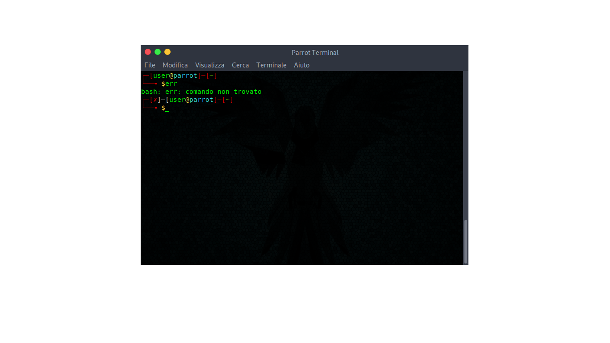
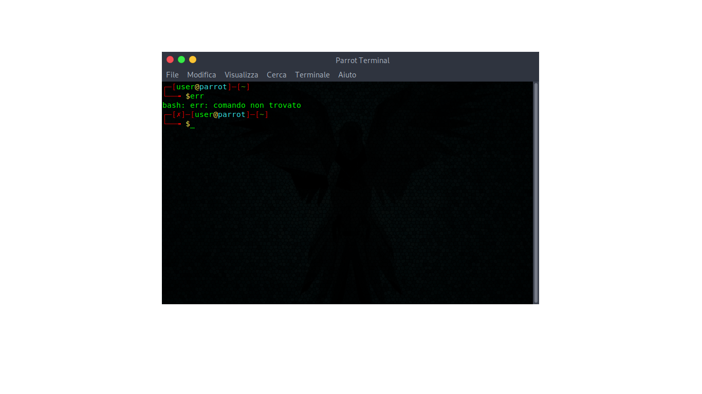

# Parrot shell .bashrc
A color-fixed version of the .bashrc file of the italian ParrotOS operating system.
When a wrong command is executed, or an error occures, the square brackets are now red instead of white.

This is how the original shell is:

This is what we fixed:

I don't know if this is an error or is on purpose, but we thought that seeing two white square brackets, when all the other components are red, is not that nice.

@Biagio00 and I have modified the .bashrc file.
